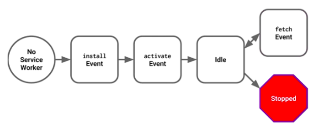
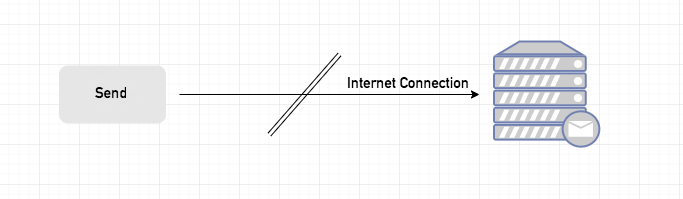

## 1. PWA란

Progressive Web App은 사용자의 이용에 따라 쌓여가는 캐시를 통한 *점진적인* 개선을 통해 만들어지며, 다음과 같은 점에서 *앱처럼* 동작하는 웹이라고 할 수 있다.

- 오프라인 상태, 불안정한 네트워크 상태에서도 안정적으로 뷰를 띄울 수 있다 → **Instant Loading**
- 디바이스 홈 스크린에 아이콘을 추가할 수 있다 → **Web App Manifest**
- 푸시 알림을 보낼 수 있다 → **Push API, Notification API**

### 1-1. 장점

PWA의 가장 중요한 요소는 *오프라인 캐싱*인데, 이로 인해 다음과 같은 이점을 얻을 수 있기 때문이다.

- 네트워크 상태에 상관없이 어플리케이션 이용이 가능하도록 하여 더 나은 UX를 제공한다.
- 네트워크를 통해 데이터를 요청받는 것보다 캐시를 통해 요청받는 것이 훨씬 빠르므로 성능 향상을 가져다준다.

### 1-2. 로컬 캐싱만으로는 충분하지 않은 이유

사실 캐싱으로 인한 성능 향상은 PWA에서 처음 등장한 얘기가 아니다. 웹 브라우저는 이미 로컬 스토리지에 캐싱을 하고 있었다.
하지만 로컬 캐시된 데이터는 오프라인 상태에서 사용할 수 없고, 온라인 상태라 하더라도 캐시된 데이터를 제대로 활용하지 못하는 경우가 많다.

- 페이지에 처음 방문한 경우. 캐시된 데이터는 존재하지 않는다. → first visit
- 캐시된 데이터를 사용자가 삭제했거나, 백신이 삭제했거나, 간헐적인 브라우저 버그로 인해 삭제된 경우. → cleared
- 로컬 캐시 저장소 공간은 한정되어 있어서 새로 캐싱하기 위해 기존의 오래된 캐싱 데이터를 삭제한 경우. → purged
- 데이터의 캐싱 기간이 만료된 경우. 캐싱 기간이 만료되면 캐싱 데이터의 내용이 유효해도 이를 재사용할 수 없고, 새로 요청해야 한다. → expired
- 캐싱되어 있었는데 페이지에 변경사항이 생겨 기존 캐시된 데이터를 사용할 수 없는 경우. → revved

따라서 기존의 로컬 스토리지 캐싱 방식으로는 PWA의 오프라인 캐싱을 대체할 수 없다.

### 1-3. 단점

#### 1-3-1. 네이티브 앱에 비해 제한된 기능

PWA가 네이티브 앱을 완전히 대체할 수도 있겠다는 생각이 들겠지만, PWA는 네이티브 앱과 비교했을 때 다음과 같은 제약사항이 있다.

- 네이티브 앱과 비교했을 때 iOS PWA
  - 오프라인 캐시된 데이터 저장소 용량이 50MB로 한정되어 있다.
  - 사용자가 앱을 몇 주동안 사용하지 않으면 iOS가 해당 앱의 캐싱 데이터를 날려버린다. 아이콘은 그대로 홈 스크린에 남아있지만, 다시 앱을 실행하면 처음부터 다시 캐싱한다.
  - 블루투스, 터치아이디, 페이스아이디, ARKit, 배터리 정보, 연락처, 위치 정보, 네이티브 소셜 앱 등에는 접근이 불가능하다.
  - Siri가 앱을 찾지 못한다.
  - 푸시 알림과 아이콘 뱃지 설정이 불가능하다.

#### 1-3-2. iOS/브라우저 지원 이슈

아직 브라우저별 지원이 완벽하진 않다. 최근 iOS 11.3 이상 버전과 Safari에서 Service Worker를 정식 지원하기 시작했지만 Push Notification은 지원하지 않는다. Chrome과 Firefox에서는 모든 PWA 요소를 정식 지원하고 있고, Edge에서는 현재 개발단계에 있으며 IE에서는 지원하지 않는다.

모바일에서도 Android와 iOS에서 가능한 기능들이 조금씩 다르다.

- iOS에서는 안 되지만 Android에서는 되는 것
  - 50MB 이상 오프라인 캐싱 데이터를 저장할 수 있음
  - 사용자가 오랫동안 앱을 사용하지 않아도 데이터를 삭제하지 않음 (단, 저쟝용량의 압박이 있을 때에는 예외)
  - 만약 사용자가 어떤 앱을 자주 사용하면 PWA는 해당 데이터를 영구 저장소에 저장하도록 요청할 수 있음
  - 블루투스 접근 가능
  - 백그라운드 동기화 가능, 푸시 알림 가능
  - 사용자가 네이티브 앱을 설치하도록 상단에 배너를 띄울 수 있음

- Android에서는 안 되지만 iOS에서는 되는 것
  - 사용자가 앱 설치 전에 아이콘의 이름을 지정할 수 있음
  - 설정 → Safari → 고급 → Experimental Features에서 Service Worker를 키고 끌 수 있음

---

## 2. Instant Loading

*Service Worker*는 브라우저 백그라운드에서 실행되는 스크립트로, 웹페이지 또는 사용자 인터랙션과 별개로 작동한다. 어떻게 보면 사용자 측에서 동작하는 프록시와 유사하다고 할 수 있다.

- Service Worker로 할 수 있는 것들
  - 페이지의 네트워크 트래픽 트래킹
  - 푸시 알림 (백그라운드 프로세싱)
  - offline first 웹 어플리케이션 개발 (with Cache API)
- 할 수 없는 것들
  - DOM element manipulating
  - http 사용 (단, 로컬에서 디버깅할 때에는 가능)
  - 80번 port 사용

### 2-1. Service Worker의 생명주기

Service Worker는  *등록*, *설치*, *활성*의 세 단계의 라이프 사이클을 거친다.



다시 기억할 점은 Service Worker의 life cycle은 웹페이지와는 완전히 별개라는 것이다.

#### 2-1-1. 등록<sup> Registration </sup>

맨 처음 등록 단계에서 하는 일은 static 데이터들을 캐싱하는 작업이다. 모든 파일이 성공적으로 캐싱되면 Service Worker가 설치된다. 만약 파일 다운로드 및 캐싱에 실패하면 등록 단계는 실패하고, Service Worker가 비활성화되어 설치되지 않는다. 실패한 작업은 이후에 재시도된다.

아래는 등록 단계의 예시 코드이다. 이 코드를 포함하고 있는 `register` 함수는 `sw.js` 파일을 파라미터로 갖는다.

```js
if ('serviceWorker' in navigator) {
    try {
      var swRegistration = await navigator.serviceWorker.register("sw.js");
      console.log("Service Worker is registered");
    } catch (error) {
      console.log("Service Worker registration is failed");
    }
} else {
    console.log("Service Worker is not supperted");
}
```

#### 2-1-2. 설치<sup> Installation </sup>

설치 단계에서는 `sw.js`가 존재하지 않거나 업데이트가 필요한 경우 이를 설치하는 작업을 진행한다.

```js
self.addEventListener("install", async e => {
    console.log("Service Worker is intalled");

    var cache = await caches.open("pwa-static");
    cache.addAll([
        "./",
        "./main.js",
        "./styles.css",
        "./noconnection.json",
        "./images/noconnection.png"
    ]);
});
```

#### 2-1-3. 활성<sup> Activation </sup>

설치가 완료되면 활성 단계가 진행되는데, 이 단계에서는 필요한 이벤트를 처리하거나 오래된 캐시를 관리할 수 있다.

Service Worker는 사용자가 다른 페이지로 이동하거나 새로고침을 했을 때 `fetch` 이벤트를 통해 기존 캐싱 데이터를 가져오거나 네트워크로부터 데이터를 다운로드받는다.

주의해야 할 점은, `sw.js` 파일의 현재 디렉토리 경로와 그 하위 경로만 fetch 할 수 있다는 것이다.

```js
self.addEventListener("fetch", function(e) {
    e.respondWith(
        caches.match(e.request)
            .then(function(response) {
                if (response) return response;
                return fetch(e.request);
            })
    );
});
```

### 2-2. 정적/동적 데이터 로딩

static 데이터를 캐시에서 먼저 받아와 보여주고, 네트워크 응답 후 dynamic 데이터, 캐시와 함께 페이지를 갱신하는 방법으로 설계할 수 있다.

### 2-3. 디버깅

Chrome 브라우저의 개발자도구 → Application → Service Workers 탭에서 Service Worker를 업데이트, register 취소, 정지할 수 있다. 또한 Push 버튼으로 푸시 알림을 보내거나 Sync 버튼으로 백그라운드 동기화 이벤트를 실행시킬 수 있다.

---

## 3. 백그라운드 프로세싱

### 3-1. Background Sync

*Background Sync*는 네트워크 연결이 안정화될 때까지 작업을 지연시킬 수 있는 웹 API이다.

동작을 이해하기 위한 예시로, 브라우저에서 이메일을 보내는 클라이언트 어플리케이션을 이용할 때 네트워크 연결이 불안정한데 사용자는 이를 인지하지 못하는 경우를 살펴보자.



사용자는 메일 작성을 마치고 전송 버튼을 누르지만, 네트워크 연결이 불안정하여 메일 서버로 메일을 전송할 수 없게 된다. 이런 상황에서 다음과 같이 처리할 수 있다.


1. 사용자가 전송 버튼을 누르면, 메일 내용은 IndexedDB에 우선 저장된다.
2. Background Sync를 Registration한다.
3. 만약 네트워크 연결이 정상적일 경우, 모든 메일 내용은 정상적으로 메일 서버로 전송된다.
4. 만약 네트워크 연결이 불안정할 경우, Service Worker는 윈도우가 닫히더라도 네트워크 연결이 정상적으로 돌아올 때까지 기다린다. 그러다 네트워크가 정상적으로 연결이 되면 그 때 메일 내용을 메일 서버로 전송한다.

위와 같은 방식으로 Service Worker는 Background Sync API를 이용해 불안정한 네트워크 상태에서도 정상적으로 어플리케이션을 동작시킨다.

### 3-2. Push Notification

*Push Notification* 이벤트는 서버로부터 받은 푸시 알림 처리한다. 아래는 예시 코드이다.

```js
self.addEventListener("push", e => {
    if (e && e.data) {
        var data = e.data.json();
        if (data.method === "pushMessage") {
            e.waitUntil(self.registration.showNotification("HELLO WORLD", { body: data.message }));
        }
    }
});
```

---

## 4. Manifest로 PWA 설정하기

웹 어플리케이션 manifest는 웹 페이지를 나타내는 방식을 개발자가 제어하고, 사용자가 시작할 수 있는 항목을 지시하고, 시작 시의 모습을 정의할 수 있도록 하는 JSON 파일이다. 웹 어플리케이션 manifest는 모든 사이트에서 사용될 수 있으며, PWA에서는 필수이다.

### 4-1. Installable Web App

PWA에서 manifest의 가장 주요한 기능은 홈 스크린에 아이콘으로 웹 페이지의 북마크를 저장하고, 이렇게 생성된 아이콘을 통해 웹 페이지를 실행시켰을 때 화면에 보여지는 부분을 설정하는 것이다.

다음은 일반적인 PWA의 manifest JSON 파일 예시이다.

```json
{
    "name": "PWA DEMO",
    "short_name": "Demo",
    "icons": [
        {
            "src": "icon-md.png",
            "sizes": "96x96"
        }, {
            "src": "icon-lg.png",
            "sizes": "192x192"
        }
    ],
    "theme_color": "#3F51B5",
    "background_color": "#F5F5F5",
    "display": "standalone",
    "orientation": "portrait",
    "start_url": "/pwa-demo/?home=true"
}
```

- `short_name`, `icons`는 모바일 디바이스의 홈 스크린에 생성되는 아이콘 형태의 북마크와 관련된 설정이다.
- `name`, `icons`, `background_color`는 맨 처음 PWA를 실행했을 때 나타나는 Splash Screen과 관련된 설정이다.
- `theme_color`, `display`는 상태바 유무, 상태바 배경색과 같은 PWA의 디스플레이와 관련된 설정이다.
- `orientation`은 가로보기, 세로보기와 관련된 설정이다.
- `start_url`은 처음 PWA를 실행했을 때 시작 주소와 관련된 설정이다.

---

## References

- [Progressive Web Apps](https://developers.google.com/web/progressive-web-apps/)
- [A Selection of Progressive Web Apps](https://pwa.rocks/)
- [현실적 PWA](http://netil.github.io/slides/pwa/#/)
- [Progressive Web Apps on iOS are here](https://medium.com/@firt/progressive-web-apps-on-ios-are-here-d00430dee3a7)
- [What is a Service Worker?](https://medium.com/commencis/what-is-service-worker-4f8dc478f0b9)
- [The Web App Manifest](https://developers.google.com/web/fundamentals/web-app-manifest/)
- [Your First Progressive Web App](https://developers.google.com/web/fundamentals/codelabs/your-first-pwapp/)
