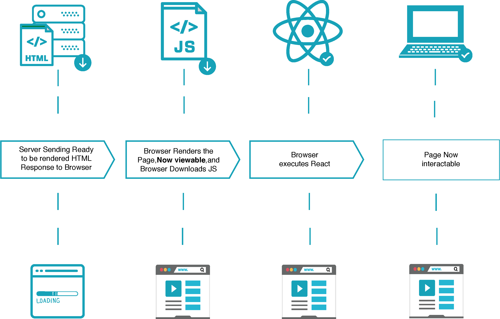

## 렌더링 주체

### 서버 사이드 렌더링

전통적인 방식에서의 웹 페이지 구동 방식이다. 페이지 요청이 있을 때마다 서버에 요청을 보내고, 서버에서 HTML을 비롯한 View를 만들어서 응답한다.

다음과 같은 조건이라면 서버 사이드 렌더링을 고려할 수 있다.

- 네트워크가 느리다
- 서버에서 페이지를 렌더링할 충분한 리소스를 들고 있다
- 메인 스크립트 파일이 크고 느리다 (클라이언트 사이드 렌더링에서는 큰 스크립트 파일을 로드하기 전까지 아무 동작도 못 할 것이다)
- SEO가 중요하다

이후 점차 웹에서 제공되는 정보량이 많아지면서 전통적인 방식과는 다른 SPA(Single Page Application) 방식이 나왔다.

### 클라이언트 사이드 렌더링

서버 측에서는 맨 처음에 하나의 빈 페이지만 제공하고, View에 대해서는 클라이언트 측에서 JavaScript를 통해 렌더링하는 방식이다. SPA에서 이 방식을 사용한다.

다음과 같은 조건이라면 클라이언트 사이드 렌더링을 고려할 수 있다.

- 네트워크가 빠르다
- 서버가 서버 사이드 렌더링을 하기 벅차다
- 데이터 첫 로드까지 걸리는 시간이 길다
- 메인 스크립트 파일이 작고 빨리 로드된다

### 각각의 장단점

주요한 차이점은 *초기 View 로딩 속도*와 *SEO*이다.

서버 사이드 렌더링은 

1. View를 서버에서 렌더링한 후 가져오기 때문에 첫 로딩이 매우 짧고,
2. 검색엔진에 웹페이지의 내용을 노출할 수 있어 SEO가 용이하고,
3. 민감한 API를 노출하지 않아도 되지만
4. 페이지 요청마다 서버에 계속 요청을 보내고, 서버 자원을 이용해서 렌더링하므로 서버에 부담이 커지는 단점이 있다.

클라이언트 사이드 렌더링은 

1. API 서버만 분리할 수 있고,
2. View 컴포넌트를 재활용할 수 있고,
3. 컴포넌트간의 다양한 이벤트를 적용할 수 있고,
4. 독립적인 개발 및 테스트가 용이하고,
5. 브라우저에서 초기 로딩/렌더링이 된 이후에는 서버에 다시 요청할 필요 없이 클라이언트 내에서 작업이 이루어지므로 매우 빠르지만 
6. 구글을 제외한 검색엔진에게 빈 페이지만 노출되므로 SEO에 큰 문제점이 있다.

각각의 장단점을 적절히 조합해서 초기 로딩을 서버 사이드 렌더링으로 하고, 이후부터 요청은 클라이언트 사이드 렌더링으로 처리하는 방법이 있다.

---

## React와 서버 사이드 렌더링

### Isomorphic

Isomorphic은 같은 모양과 형태를 공유한다는 뜻으로, 서버 사이드와 클라이언트 사이드가 같은 코드를 사용해서 개발하는 것이다.

사람마다 isomorphism의 범주에 대한 정의가 다른데, 어떤 사람은 같은 언어를 공유하면 isomorphic하다고 하고, 어떤 사람은 같은 언어로 짠 동일한 코드가 백/프론트 플랫폼에서 모두 돌아가야 된다고 한다. 결국 중심 내용은 서버 사이드 렌더링과 클라이언트 사이드 렌더링의 코드 및 스킬셋이 다르면 isomorphic하다고 할 수 없다는 것이다.

---

## Spring에서 서버 사이드 렌더링

### Nashorn

#### 동작 원리

Nashorn은 *Java8 버전부터 JVM의 공식 JavaScript 엔진*이다. Nashorn은 런타임동안 JavaScript를 Java 바이트 코드로 컴파일한다. 따라서 Java와 JavaScript끼리 상호 운용이 원활하지만, 속도가 느리다.

#### 대체재

- *Rhino*: Rhino는 mozilla에서 개발한 JavaScript 엔진이다 Java 7버전까지는 이걸 주로 사용했다. JVM이 발전해가면서 Rhino도 많은 성능 개선이 이루어졌지만, WebKit의 JavaScript Core나 구글의 V8도 내부적으로 JavaScript를 컴파일하기 때문에 Rhino가 가지는 성능상의 이점은 없다 (사실상 더 느리다). Nashorn은 오래된 Rhino를 대체해 나온 새로운(당시엔..) JavaScript 엔진이다.
- *Handlebars*: 추후 내용 추가 예정

#### 한계점

- 구글 V8과 비교해서 확연한 성능 차이가 있다. 내부적으로 벤치마킹을 한 결과 V8이 동일한 작업에서 Nashorn보다 10-30% 더 나은 성능을 보였다고 한다. ([링크](https://www.quora.com/How-does-Nashorn-compare-to-V8))
- 글로벌 바인딩을 하는 부분에서 thread safe하지 않을 수 있다. ([링크1](https://stackoverflow.com/questions/30140103/should-i-use-a-separate-scriptengine-and-compiledscript-instances-per-each-threa/30159424#30159424), [링크2](https://kazkn.com/post/2017/spring-boot-nashorn-react-ssr/) 좀 더 이해 필요)
    - Nashorn의 thread safety 이슈
        - thread safe: 멀티스레드 프로그래밍에서 일반적으로 어떤 함수나 변수, 혹은 객체가 여러 스레드로부터 동시에 접근이 이루어져도 프로그램의 실행에 문제가 없는 것. 하나의 함수가 한 스레드로부터 호출되어 실행 중일 때, 다른 스레드가 그 함수를 호출하여 동시에 함께 실행해도 각 스레드에서의 함수 수행 결과가 올바로 나오는 것.
        - thread safe를 지키기 위한 방법
            - re-entrancy: 어떤 함수가 한 스레드에 의해 호출되어 실행중일 때, 다른 스레드가 그 함수를 호출하더라도 그 결과가 각각에게 올바로 주어져야 한다
            - thread-local storage: 글로벌 자원의 사용을 최대한 줄여 각각의 스레드에서만 접근 가능한 저장소들을 사용함으로써 동시 접근을 막는다. 이 방식은 동기화 방법과 관련있고, 글로벌 자원의 공유 상태를 피할 수 없을 때 사용하는 방식이다
            - mutual exclusion: 공유 자원을 꼭 사용해야 할 경우 해당 자원의 접근을 세마포어, 뮤텍스 등의 락으로 통제한다. 통상적으로 상호 배제 방식을 이용한 크리티컬 섹션 처리가 자주 사용되는 편이다.
            - atomic operations: 공유 자원에 접근할 때 원자 연산을 이용하거나 상호 배제를 구현한다
        - Nashorn이 tread safe하지 않은 이유: 스레드간에 객체 `ScriptEngine`과 `CompiledScript` 객체를 공유하는데, 이 둘은 thread safe하지만 `Binding` 오브젝트는 그렇지 않다. bindings 객체는 기본적으로 JavaScript 런타임 환경에서 글로벌 객체에 해당되는데, Nashorn 엔진이 멀티스레드 환경에서 이 인스턴스를 사용하는 경우 각 스레드마다 각각의 바인딩 오브젝트를 얻기 위해 `engine.createBindings()`를 호출해야 한다. 만약 이를 사용하는 오브젝트가 immutable하다면 하나의 바인딩 인스턴스로 여러 스레드에 걸쳐 사용해도 괜찮지만, 그렇지 않다면 동기화를 꼭 해야 한다.
- 프론트엔드와 어느정도 코드가 중복되는 부분이 생기고, 스프링 프로젝트에 리액트 코드가 조금씩 섞여서 백/프론트 코드가 깔끔하게 분리되지 않는 찝찝함이 있다.
- 레퍼런스가 굉장히 부족하다. [공식 위키 문서](https://wiki.openjdk.java.net/display/Nashorn/Main)는 마지막 업데이트가 2016년 5월 14일이다. [구글 트렌드](https://trends.google.com/trends/explore?date=today%205-y&q=Nashorn,%2Fm%2F012l1vxv,Spring%20Boot)에서도 리액트와 비교해서 검색비율이 많이 저조하다.
- ES6 지원이 미흡하다. 2018년 초 기준으로 다음의 제한적인 부분들만 지원했다. ([링크](http://mail.openjdk.java.net/pipermail/nashorn-dev/2018-January/007309.html))
    - Template strings
    - let, const, and block scope
    - Iterators and for .. of loops
    - Map, Set, WeakMap, and WeakSet
    - Symbols
    - Binary and octal literals
- *[Nashorn is deprecated in Java 11](https://openjdk.java.net/jeps/335)!* ES6의 발전속도를 따라잡기 힘들어서 포기한다고 한다.

### Node.js

JVM 위에 JavaScript용 엔진을 올려서 쓸 수 없다면 어쩔 수 없이 백엔드에 요소를 하나 더 둬야 한다. Spring 서버는 단순히 API 서버로만 두고, React와의 사이에 Node.js를 둬서 API 콜 한 결과와 함께 첫 페이지 렌더링을 해서 돌려주는 역할을 수행하도록 할 수 있다.

React와 Node.js의 조합은 아주 레퍼런스가 많고, Isomorphic하기 때문에 개발은 훨씬 간단해질 수 있다. 그러나 개발에 신경써야 할 요소가 하나 더 늘어나고, 네트워크 딜레이가 한 단계 더 생긴다.

### Spring-React 조합이 드문 이유

가장 큰 이유는 Spring과 React로 isomorphism을 만족시키기 어렵기 때문인 것 같다. isomorphic해야 하는 이유는 isomorphic하게 개발해야 서버에서 ViewTemplate을 그릴 때 썼던 코드 그대로 클라이언트에서 컴포넌트나 이벤트를 재활용할 수 있기 때문이다. Spring에서 Nashorn같은 Script 엔진을 새로 만들지 않는다면, 앞으로 중간에 Node.js를 끼지 않고 온전히 Spring과 React만 사용해서 서버 사이드 렌더링을 구현하는 것은 어려울 것 같다. 단, 지금처럼 클라이언트 사이드 렌더링은 충분히 가능하다.

### React와 SSR을 위한 추천 조합

Node.js로 서버를 만들면 쉬워진다. 최근까지 활발하게 업데이트가 이루어지고 있는 [react-ssr](https://www.npmjs.com/package/react-ssr)이나 [react-node-ssr](https://www.npmjs.com/package/react-node-ssr) 같은 패키지들이 있다.