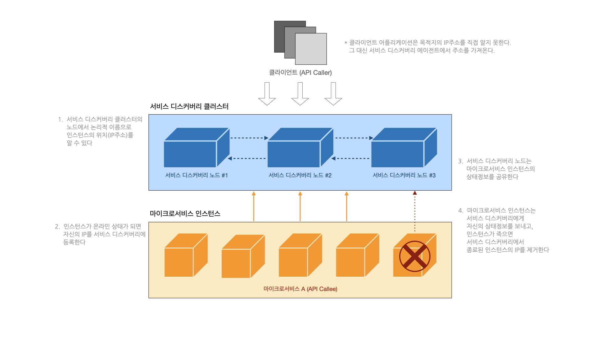
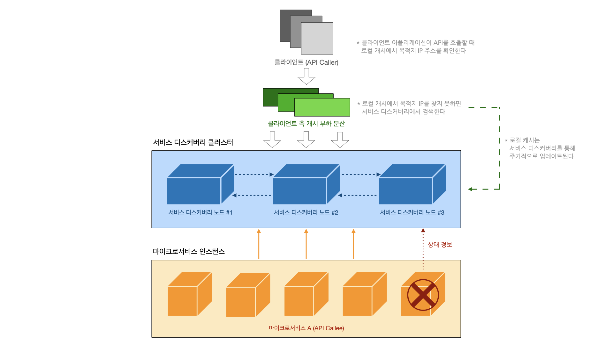
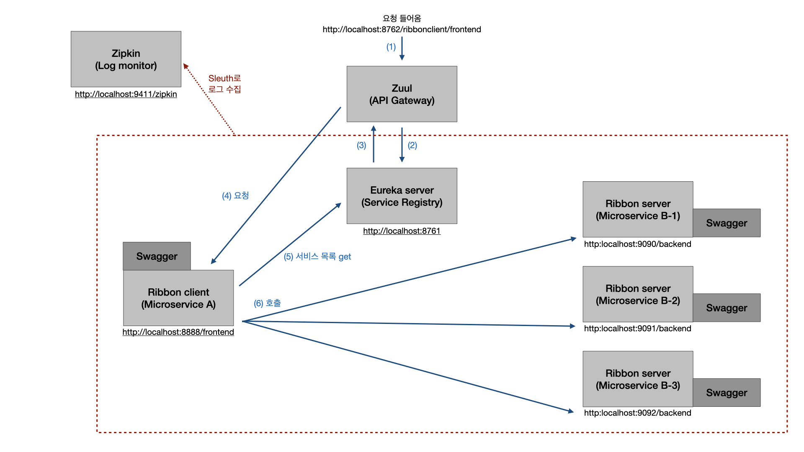

## 1. Spring Cloud Netfix

Spring Cloud Netflix는 자동 환경 설정과 Spring Environment 및 다른 Spring 프로그래밍 모델 관념의 바인딩을 바탕으로 Spring Boot 어플리케이션을 위한 Netflix OSS (Open Source Software) 통합을 제공합니다. 몇 가지 간단한 어노테이션을 사용하여 어플리케이션 내부의 공통 패턴을 신속하게 사용하고 설정할 수 있습니다. 그리고 battle-test를 거친 Netflix 컴포넌트를 통해 대규모 분산 시스템을 구축할 수 있습니다. 제공되는 패턴에는 Service Discovery (Eureka), Circuit Breaker (Hystrix), Intelligent Routing (Zuul), 그리고 Client Side Load Balancing (Ribbon) 등을 제공합니다. [출처](https://spring.io/projects/spring-cloud-netflix#overview)

### 1-1.  전제조건

여기에서는 아래와 같은 목표/니즈가 있는 **클라우드 환경**의 **MSA** 기반 시스템을 가정합니다.

- *적정 크기*: 어플리케이션을 신속하게 변경하고 전체 어플리케이션의 전반적인 장애를 줄일 수 있도록 마이크로서비스 하나 당 한 가지 책임 영역에 집중함
- *위치 투명성*: 대고객 서비스에 영향을 주지 않고 마이크로서비스 인스턴스를 빠르게 추가/삭제할 수 있도록 인스턴스의 물리적 위치를 관리함
- *회복성*: 서비스에 문제가 발생했을 때 대고객 서비스에 영향을 최소화하기 위하여 장애가 발생한 인스턴스를 우회하고 ‘발리 실패’하게 함
- *반복성*: 새로운 마이크로서비스 인스턴스가 시작될 때마다 벼롣의 복잡한 매뉴얼 작업 없이 기존 인스턴스와 동일한 코드/구성으로 시작되도록 함
- *확장성*: 서비스 간 의존성을 최소화하면서 어플리케이션이 신속하게 확장할 수 있도록 비동기 프로세싱과 이벤트를 활용함

이를 위해서 이론적으로 다음 6가지 마이크로서비스 패턴을 따릅니다.

1. 핵심 개발 패턴 (core development patterns); 어플리케이션을 어떻게 *적정 크기*로 나눌 것인지
2. 라우팅 패턴 (routing patterns): 어플리케이션 간의 *위치 투명성*을 어떻게 보장할 것인지 → Zuul, Eureka, Ribbon
3. 클라이언트 회복성 패턴 (client resiliency patterns): *회복성*을 어떻게 보장할 것인지 → Hystrix
4. 보안 패턴 (security patterns): AAA (Authentication, Authorization, Accounts)를 어떻게 관리할 것인지 → Zuul
5. 로깅 및 추적 패턴 (logging and tracing patterns): 어떻게 어플리케이션을 디버깅하고 추적할 것인지 → Zuul
6. 빌드 및 배포 패턴 (build and deployment patterns): 어플리케이션의 *반복성*과 *확장성*을 어떻게 보장할 것인지

---

## 2. Eureka as Service Discovery

### 2-1. 기존의 서비스 디스커버리

서비스 디스커버리의 역할은 크게 아래 2가지로 꼽을 수 있습니다.

1. 마이크로서비스 인스턴스 (API Callee)의 물리적 주소를 클라이언트 (API Caller)에게 드러내지 않아야 한다
2. 어플리케이션의 회복성을 위해 정상적인 상태가 아닌 인스턴스는 가용 인스턴스 목록에서 제거해야 한다

여기가지 보면 기존의 L4나 DNS를 사용해도 무방할 것으로 보입니다. 그러나 이는 클라우드 기반의 마이크로서비스 아키텍처에서 아래와 같은 한계점을 갖고 있습니다.

- 로드밸런서를 다중화한다고 해도, 여전히 SPOF(Single Point Of Failure, 단일 장애 지점)이 될 수 있다
- 보통 상용 로드밸런서는 hot-swap 이중화를 지원한다 (active 한 대, stand-by 한 대)
- 새로운 인스턴스의 추가/삭제 과정이 느리다 (자동화 X, 수작업 필요)
- 새로운 인스턴스의 추가/삭제 시 위치 투명성 보장이 불투명해진다

### 2-2. 클라우드 기반 마이크로서비스 아키텍처에서의 서비스 디스커버리

클라우드 기반의 MSA 환경에서는 아래 기능을 갖춘 서비스 디스커버리가 적합합니다.

- 기존 로드밸런서보다 고가용성을 보장한다 (서비스 디스커버리 클러스터 구축)
- 기존 로드밸런서가 하던 부하 분산 역할도 당연히 수행한다
- 서비스 디스커버리 클러스터의 각 노드는 마이크로서비스 인스턴스의 상태를 공유한다
- 서비스 디스커버리는 각 인스턴스의 상태를 지속적으로 감지하며 특정 인스턴스가 정상적이지 않을 때 가용 서비스 목록에서 해당 인스턴스를 제거한다
- 모든 마이크로서비스 인스턴스는 서비스 디스커버리의 가용 서비스 목록을 로컬에 캐싱해 가지고 있으며, 서비스 디스커버리가 죽었을 때 캐싱된 목록을 활용해 계속 서비스를 이어나갈 수 있도록 한다

간단히 위 목록을 도식화한 그림은 아래와 같습니다.



### 2-3. Eureka Server 구성

기본적으로 아래의 3개 어플리케이션이 필요합니다.

1. 서비스 디스커버리 노드가 될 Eureka Server 어플리케이션
2. Eureka를 통해 API를 호출할 API Caller 어플리케이션 A
3. A의 요청에 대해 응답을 줄 API Callee 어플리케이션 B

Eureka Server 어플리케이션을 간단하게 만들어봅니다.

- 의존성 추가 (build.gradle 파일)

```java
dependencies {
	implementation ‘org.springframework.cloud:spring-cloud-starter-netflix-eureka-server’
}
```

- Eureka Server 어노테이션 추가

```java
@SpringBootApplication
@EnableEurekaServer    // 이 부분
public class EurekaServerApplication {
	...
}
```

- 구성 설정 (application.properties 파일)

```conf
server.port=8761    // Eureka Server가 listen할 포트
eureka.instance.hostname=eureka    // Eureka Server의 호스트명
eureka.client.registerWithEureka=false    // Eureka Server에 자기 자신을 등록하지 않겠다는 의미
eureka.client.fetchRegistry=false    // 레지스트리 정보를 로컬에 캐싱하지 않겠다는 의미
eureka.client.serviceUrl.defaultZone=http://${registry.host:localhohst}:${server.port}/eureka
```

여기가지 구성 후 어플리케이션을 실행시켜 `localhost:8761`로 접속하면 간단한 Eureka Server 대시보드를 확인할 수 있습니다.
지금은 Eureka Server에 등록된 인스턴스가 없기 떄문에 빈 목록이 보입니다.

### 2-4. 인스턴스 구성

서비스 디스커버리에 등록할 API Caller, API Callee 어플리케이션을 만들어봅니다.

- 의존성 추가 (build.gradle 파일)

```java
dependencies {
	implementation ‘org.springframework.cloud:spring-cloud-starter-netflix-eureka-client’
}
```

- 인스턴스 등록 어노테이션 추가

```java
@SpringBootApplication
@EnableDiscoveryClient    // 이 부분
public class ApiCalleeApplication {
	...
}
```

- 구성 설정 (application.properties 파일)

```conf
spring.application.name=apicallee    // 서비스 디스커버리에 등록할 인스턴스의 논리적 이름
eureka.instance.preferIpAddress=true    // 인스턴스 이름 대신 IP주소를 등록하겠다는 의미
eureka.client.registerWithEureka=true    // Eureka Server에 자기 자신을 등록하겠다는 의미
eureka.client.serviceUrl.defaultZone=http://${registry.host:localhohst}:${server.port}/eureka
```

Eureka Server에 등록하는 인스턴스 식별자로는 ApplicationID와 InstanceID가 있습니다. ApplicationID는 인스턴스의 그룹을 의미하며, 위 프로퍼티 파일에서 명시한 spring.application.name입니다. InstanceID는 동일한 인스턴스가 여러 개 떠 있을 때, 각 인스턴스를 구분하는 임의의 숫자입니다.

인스턴스의 논리적 이름 대신 IP주소를 등록하는 이유는 컨테이너 기반 (e.g. Docker) 배포 시 컨테이너가 DNS 엔트리가 없는 임의로 생성된 호스트명을 부여받아 시작하기 때문에, API Caller가 API Callee의 위치를 정상적으로 찾지 못합니다. 이를 방지하기 위해 항상 `eureka.instance.preferIpAddress=true`로 설정해두는 편이 적절하다고 합니다.

이렇게 인스턴스가 Eureka Server에 등록되면 Eureka Server는 지속적인 health check를 통해 인스턴스의 상태를 가용 인스턴스 목록에 업데이트할 것입니다. 보통 Eureka Server에 등록된 인스턴스는 기본옵션 30초마다 자신의 상태를 Eureka Server에 알리며, 이 주기는 변경 가능합니다.

---

## 3. Ribbon as Client Side Load Balancing

### 3-1. 서비스 디스커버리만으로 충분하지 않은 이유

Eureka Server만 있다고 가정하면, 모든 API 요청은 Eureka Server를 통하게 되어 Eureka Server가 새로운 병목 지점이 될 수 있습니다. 서비스 디스커버리 의존성을 줄이기 위해 클라이언트 부하 분산이라는 방법을 사용할 수 있으며, 여기에 Ribbon이 활용됩니다.

### 3-2. 클라이언트 부하 분산의 역할

- 서비스 디스커버리의 가용 인스턴스 목록을 캐싱하여 각 마이크로서비스 인스턴스 로컬에 저장한다
- 어떤 인스턴스가 API를 호출할 때 먼저 로컬에 캐싱된 인스턴스 목록을 참조한다
- 일반적으로 클라이언트 측 캐싱은 Round-Robbin 알고리즘을 사용해 API 호출을 여러 인스턴스로 분산한다
- 주기적으로 서비스 디스커버리에 접속해 로컬 캐시를 업데이트한다

클라이언트 로드밸런서를 추가한 그림은 아래와 같습니다.



### 3-3. RestTemplate을 사용한 Ribbon 구성

Spring Cloud 초기에는 Ribbon이 RestTemplate 클래스를 지원했지만, 현재는 더이상 지원되지 않습니다.
따라서 RestTemplate에서 Ribbon을 사용하려면 `@LoadBalanced` 어노테이션을 직접 추가해줘야 합니다.
다른 대안은 Netflix Feign 클라이언트로 서비스를 호출하는 것인데, 후에 추가하도록 하겠습니다.

- 의존성 추가 (build.gradle 파일)

```java
dependencies {
	implementation ‘org.springframework.cloud:spring-cloud-starter-netflix-ribbon’
}
```

- RestTemplate 정의

```java
@LoadBalanced
@Bean
RestTemplate restTemplate() {
	return new RestTemplate();
}
```

- 클라이언트 로드밸런서 어노테이션 추가

```java
@SpringBootApplication
@EnableDiscoveryClient
@RibbonClient(name = "apicallee", configuration = RibbonConfiguration.class)    // 이 부분
public class ApiCallerApplication {
	...
	@Autowired
	RestTemplate restTemplate;
	
	...
	@RequestMapping("/ call/api")
	public String callApiB() {
		...
		this.restTemplate.getForObject("http://apicallee/answer", String.class);    // 위 RibbonClient 어노테이션에서 명시한 목적지를 서비스 디스커버리에서 검색 후 요청
	}
}
```

위의 간단한 예시에서 API Caller 역할을 하는 어플리케이션 A에 `/call/api`로 요청이 들어오면 어플리케이션 A는 API Callee 역할의 어플리케이션 B `/answer`로 요청을 보내는데, 요청을 보낼 목적지인 어플리케이션 B의 주소를 Eureka Server에 등록된 가용 인스턴스 목록에서 어플리케이션 B의 이름인 `apicallee`를 검색해 찾아냅니다.

---

## 4. Zuul as API Gateway

### 4-1. API 게이트웨이의 역할

API 호출에 대한 *보안*과 *로깅* 등을 트래킹하기 위해 각 요청에 대한 필터와 라우터 역할을 하는 API 게이트웨이가 필요합니다.

만약 API 게이트웨이가 없이 보안, 로깅, 사용자 추적 등을 각 마이크로서비스 인스턴스에서 제각각 구현하게 된다면 일관성이 떨어지고 인스턴스 간의 의존성이 더 복잡해질 수 있습니다.

마이크로서비스 아키텍처에서 API 게이트웨이는 아래와 같은 역할을 수행합니다.

- 하나의 entry point URL 뒤에 모든 서비스를 배치하고, 서비스 디스커버리를 이용해 모든 호출을 실제 인스턴스로 매핑한다
- API 게이트웨이를 경유하는 모든 호출에 고유한 ID를 삽입한다
- 호출 시 생성된 ID를 응답에도 삽입해 요청에 회신한다
- 정적/동적 라우팅을 지원한다
- 호출에 대한 인증(authentication)과 인가(authorization)을 처리한다
- 호출 로그와 이에 따른 지표를 수집한다

앞서 서비스 디스커버리 부분에서 언급했던 것처럼, API 게이트웨이도 병목지점이 될 수 있습니다. 가능한 API 게이트웨이 코드를 간결하고 stateless하게 유지하여 쉽게 다중화할 수 있어야 합니다.

### 4-2. 라우터 구성

- 의존성 추가 (build.gradle 파일)

```java
dependencies {
	implementation ‘org.springframework.cloud:spring-cloud-starter-netflix-zuul’
}
```

- API 게이트웨이 어노테이션 추가

```java
@SpringBootApplication
@EnableDiscoveryClient
@EnableZuulProxy    // 이 부분
public class ZuulApplication {
	...
}
```

- 구성 설정 (application.properties 파일)

```conf
server.port=8762
eureka.instance.hostname=zuul
eureka.client.registerWithEureka=true
eureka.client.fetchRegistry=false
eureka.client.serviceUrl.defaultZone=http://${registry.host:localhohst}:${server.port}/eureka
```

이제 Eureka Server, API Caller 어플리케이션, API Callee 어플리케이션, 그리고 Zuul 어플리케이션을 실행한 후 `localhost:8762/actuator/routes`로 접속해보면 서비스 디스커버리에 의해 zuul이 라우팅할 수 있는 API 목록을 확인할 수 있습니다.

### 4-3. 필터 구성

추후 내용 추가

---

## 5. 최종 구성도

지금까지의 내용을 바탕으로 깃랩에 올린 프로젝트를 모두 띄우면 아래와 같은 구조로 동작하게 됩니다.

