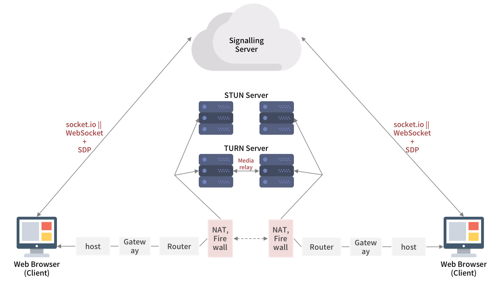

## 1. WebRTC 소개

WebRTC에서 RTC는 실시간 통신<sup> Real Time Communication </sup>의 약자로, 이름에서 알 수 있듯이 WebRTC는 **브라우저 간의 오디오, 비디오, 데이터의 실시간 P2P 커뮤니케이션을 가능하게 해 주는 오픈소스 프로젝트**입니다. 현재 Chrome, Firefox, Opera 브라우저에서 가능하며 Edge에서는 조금 다른 형태의 ORTC를 지원하고 있습니다. Safari에서는 지원하지 않았으나, iOS 11부터 WebRTC를 지원한다고 합니다 ([출처](https://flashphoner.com/ios-safari-11-now-supports-webrtc/)).

---

## 2. 시그널링<sup> Signalling </sup>

WebRTC는 P2P 방식으로 연결되지만, 여전히 서버는 필요합니다. 시그널링 서버는 *각 디바이스들을 상호 협의된 서버 (WebSocket 혹은 socket.io)에 연결시키고, 서로 주고받을 미디어 포맷을 협의하고, negotiation 메세지를 교환*할 수 있도록 해줍니다.

WebRTC에서는 시그널링 규격에 대해 따로 명세하지 않고 있습니다. 즉, 두 피어들을 연결하고 데이터를 전달할 수 있는 것이라면 WebSocket이든 socket.io든 상관없다는 것입니다.

### 2-1. JSEP<sup> JavaScript Session Establishment Protocol </sup>

JSEP는 JavaScript로 멀티미디어의 시그널링 플레인을 제어하는 매커니즘으로, WebRTC가 세션을 연결하는 데에 사용하는 offer/answer 아키텍쳐입니다.

### 2-2. SDP<sup> Session Description Protocol </sup>

시그널링 서버를 통해 전달되는 데이터 내용은 통신을 열고 닫는데 사용되는 *세션 컨트롤 메시지들, 에러 메시지들, 코덱이나 코덱 설정, 대역폭, 미디어 타입과 같은 미디어 메타 데이터, 보안 연결을 수립하기 위해 사용되는 key 데이터, 호스트의 IP 주소와 포트같은 네트워크 데이터들*이 있습니다. 이 내용들이 call을 보낸 쪽의 피어가 처음 offer를 생성할 때 SDP 정보로 함께 만들어집니다. 이렇게 만들어진 SDP 정보는 `setLocalDescription()`을 호출해 RTCPeerConnection에 전달됩니다.

---

## 3. NAT<sup> Network Address Translation</sup>

NAT는 사설<sup> private </sup> IP를 공인<sup> public </sup> IP로 변환해줍니다. NAT는 제한된 수의 공인 IP를 가지고 많은 호스트를 연결하는 효율적인 방법일 뿐만 아니라, 보안을 강화할 수 있다는 장점을 갖고 있습니다.

그러나 P2P 연결의 입장에서 NAT는 복잡한 존재입니다. 만약 NAT 없이 모두가 공인 IP를 갖고 있다면, 각 피어는 연결하고자 하는 상대방의 IP를 다이렉트로 찍어 바로 연결할 수 있을 것입니다. 그런데 대부분의 경우 각 피어가 NAT(+방화벽) 뒤에 위치해 공인 IP를 갖고 있지 않게 됩니다.

이런 상황에서 어떤 한 피어 A가 로컬 네트워크 외부의 서비스에 도달하려고 한다 가정합시다. 피어 A는 먼저 NAT 서버를 통해 요청을 생성합니다. NAT 서버는 요청의 출발지 주소<sup> source address </sup>, 즉 피어 A의 사설 IP 주소를 NAT의 IP 주소로 바꾸면서 요청을 변환<sup> translate </sup>하고, 이를 도착지로 리디렉션합니다. 또한 NAT는 출발지 주소(호스트 네임과 포트)를 변환된 주소(NAT의 호스트 네임과 피어 A에게 할당된 포트)로 매핑하는 NAT 테이블을 생성합니다. 이후 NAT가 외부 서비스로부터 응답을 받으면, NAT 테이블을 이용해 요청의 근원지인 피어 A를 찾아 여기에 응답을 리디렉션합니다.



### 3-1. STUN<sup> Session Traversal Utilities for NAT </sup>

STUN 서버는 각각 로컬 네트워크에 위치한 피어들이 공인 IP를 통해 상대방과 연결하기 위해 사용됩니다. STUN 서버는 공인 IP 망에 위치하면서 연결하고자 하는 피어가 NAT 뒤에 있는지 여부를 판별하고, 각 피어의 NAT 통과 전후의 IP를 기록해 이를 상대방 피어에게 전달해줍니다. 또한 NAT 뒤에 있는 장비는 STUN 서버에게 NAT를 벗어났을 때의 공인 IP를 물어볼 수 있습니다.

STUN 서버는 무리하게 많은 작업을 수행하거나 많은 정보를 저장하고 있지 않아 기본적으로 사양에 비해 아주 많은 양의 응답을 관리할 수 있습니다.

### 3-2. TURN<sup> Traversal Using Relays around NAT </sup>

통계적으로 약 86%의 call이 STUN 서버를 통해 P2P 연결에 성공하지만, 나머지 call들은 연결에 실패합니다. 그 원인은 각 피어 모두 symmetric NAT 뒤에 위치했거나, 어느 NAT 장비가 STUN을 지원하지 않는 등 여러가지가 있을 수 있습니다. 이렇게 되면 STUN 대신 TURN 서버를 통해 데이터가 거쳐가도록 해야 합니다.

TURN 서버는 relay 서버라고도 하는데, 말 그대로 미디어 스트림을 받아서 상대편쪽 TURN 서버에게 넘겨주는 단순한 작업을 수행합니다. 엄밀히 말하자면 P2P가 아니기도 합니다. TURN 서버 역시 공인 IP 망에 위치하고 있어서 피어들이 NAT나 방화벽, 프록시 뒤에 있더라도 연결될 수 있습니다.

그러나 많은 요청이 몰릴수록 데이터 이동량이 증가하면서 많은 대역폭을 소모하므로, 서버 부하에 특별히 신경을 써야합니다.

### 3-3. ICE<sup> Interactive Connectivity Establishment </sup>

ICE는 NAT를 뚫고 피어들을 연결하기 위한 offer/answer 모델 프레임워크로, 각 call의 최적의 경로를 찾는 역할을 합니다. ICE가 경로를 선택할 때에는 1) *NAT가 없는 네트워크를 통한 다이렉트 연결*, 2) *STUN으로 연결*, 3) *앞선 방법으로 연결되지 않는 경우 TURN을 통한 연결* 순으로 시도하고, 각 피어들은 이러한 3가지 종류의 후보들 중 하나로 P2P 연결을 진행합니다.

### 3-4. WebRTC의 동작


위의 UML 시퀀스 다이어그램에서 중간부분 Web App의 어플리케이션 서버를 통해 Alice와 Bob을 P2P로 연결하는 방법을 보여주고 있습니다. 그 과정을 순차적으로 훑어보면 다음과 같습니다.

1. 맨 처음, Alice가 Web App의 서버를 통해 RESTful API 방식으로 Bob을 call합니다.
2. WebSocket 등을 이용한 푸시 알림을 통해 서버는 Bob에게 Alice가 그를 call하고 있다는 것을 알려줍니다.
3. Bob은 푸시 알림에 응답해 Alice와 대화하겠다는 표시를 합니다.
4. 그러면 Web App은 Bob의 응답을 Alice에게 리디렉션합니다.
5. Bob이 call을 수락한 것을 Alice가 알게 되면, Alice는 ICE 후보들을 모으는 작업을 진행합니다.
6. Alice는 ICE 후보를 설정하고 나서 SDP offer를 보낼 준비를 합니다. SDP offer는 Web App의 서버를 통해 Bob에게 보내집니다.
7. 다시 Web App은 Alice의 offer를 Bob에게 리디렉션합니다.
8. Bob은 그의 ICE 후보들을 모으기 시작합니다.
9. 그리고 나서 SDP answer를 보낼 준비를 한 후, 역시 Web App의 서버를 통해 Alice에게 보냅니다. (아직까지는 Alice와 Bob 사이에 P2P 연결이 성립되지 않은 상태입니다!)
10. Web App은 Bob의 answer를 Alice에게 리디렉션합니다.
11. 이제 Alice와 Bob은 그들이 가진 ICE 후보들을 통해 P2P 연결을 시도합니다. 이 와중에 더 많은 ICE 후보들이 생겨날 수 있습니다.

---

## 4. WebRTC APIs

WebRTC에서의 3가지 주요 태스크는 1) *오디오와 비디오 얻기*, 2) *Peer간 오디오와 비디오를 중계하기*, 3) *Peer간 임의의 데이터를 중계하기* 입니다. 이를 위한 메인 API가 바로 `getUserMedia`, `RTCPeerConnection`, `RTCDataChannel`입니다.

### 4-1. getUserMedia

먼저 사용자의 카메라와 마이크같은 곳에 접근해 미디어 스트림 데이터를 얻기 위해 다음과 같이 호출합니다.

```js
navigator.getUserMedia(constraints, successCallback, errorCallback);
```

여기서 `constraint`는 어떤 미디어를 가져올 것인지 명시해놓은 것입니다. 예를 들어, 오디오는 가져오지 않고 비디오만 가져오도록 하는 코드는 다음과 같습니다.

```js
var constraint = {
    audio: false,
    video: true
};
```

만약 미디어를 가져오는 데에 성공했다면 웹캠으로부터 받은 비디오 스트림은 video tag의 source가 됩니다. 다음은 성공 시 콜백함수의 예시입니다.

```js
function successCallback(stream) {
    window.stream = stream;
    if (window.URL) {
        video.src = window.URL.createObjectURL(stream);
    } else {
        video.src = stream;
    }
}
```

각 미디어 스트림은 랜덤한 스트링의 라벨을 가집니다. `getAudioTracks()`와 `getVideoTracks()` 함수는 미디어 스트림 트랙의 배열을 반환합니다.

### 4-2. RTCPeerConnection

RTCPeerConnection에서 담당하고 있는 일들은 아주 많습니다. 피어 간 커뮤니케이션, 시그널 프로세싱, 코덱 핸들링, 암호화 및 대역폭 관리 등의 기능을 갖고 있습니다. Signalling과 헷갈릴 수 있는데, RTCPeerConnection은 미디어 스트림 정보를 피어에게 잘 전달하게끔 하는 역할을 하며 시그널링은 RTCPeerConnection API에 포함되지 않습니다.

이렇게 중요한 역할을 수행하는 RTCPeerConnection은 브라우저를 만드는 쪽에서 담당합니다. Chrome에서는 `wekbitRTCPeerConnection`으로, Firefox에서는 `mozRTCPeerConnection`으로 구현되었습니다. 이러한 브라우저간의 차이와 명세 변경에 대해 구글에서 관리하는 `adapter.js` 코드를 사용하여 호환성을 지킬 수 있습니다.

보다 단순하게 API의 동작을 확인하기 위해 중간 시그널링 과정을 빼고, 로컬 피어 caller와 원격 피어 callee의 RTCPeerConnection 코드를 살펴보겠습니다.

먼저 RTCPeerConnection을 새로 생성하고 `getUserMedia()`로부터 로컬 스트림을 얻습니다.

```js
// 파라미터의 server는 optional config file
caller = new webkitRTCPeerConnection(server);
...
caller.addStream(localstream);
```

이어서 offer를 생성하고, caller의 `Session Description`을 설정합니다. 그리고 callee의 것을 `Remote Description`으로 설정합니다. 여기서는 caller와 callee가 같은 페이지에 있기 때문에 시그널링없이 직접 코드로 연결합니다.

```js
caller.createOffer(gotDescription1);
...
function gotDescription1(desc) {
    caller.setLocalDescription(desc);
    trace('Offer from caller\n' + desc.sdp);
    callee.setRemoteDescription(desc);
    callee.createAnswer(gotDescription2);
}
```

다음으로 callee를 생성하고, caller에 스트림이 추가되면 그것을 `video` 태그에 표시합니다.

```js
callee = new webkitRTCPeerConnection(server);
callee.onaddstream = gotRemoteStream;
...
function gotRemoteStream(e) {
    video2.src = URL.createObjectURL(e.stream);
}
```

### 4-3. RTCDataChannel

일반적인 데이터의 P2P 통신은 RTCDataChannel을 통해 이루어집니다. 이는 WebSocket과 같은 API로, 브라우저간 직접 연결되어 엄청나게 낮은 대기시간<sup> latency </sup>이 특징입니다.

```js
var pc = new webkitRTCPeerConnection(server, {
    optional: [{ RtpDataChannels: true }]
});

pc.ondatachannel = function(event) {
    receiveChannel = event.channel;
    receiveChannel.onmessage = function(event) {
        document.querySelector('div#receive').innerHTML = event.data;
    };
};

sendChannel = pc.createDataChannel('sendDataChannel', { reliable: false });

document.querySelector('button#send').onclick = function() {
    var data = document.querySelector('textarea#send').value;
    sendChannel.send(data);
};
```

---

## 5. N:N 미디어 서버 아키텍처

1:1 연결의 경우, 2명의 피어는 각자의 미디어 스트림을 다이렉트로 상대방에게 주고받는 단순한 구조였습니다. 만약 3명 이상의 여러 유저가 서로 통신하고자 한다면, 피어들의 미디어 스트림이 서로에게 흘러가는 구조는 크게 다음과 같은 2가지 방법으로 생각해볼 수 있습니다.

- 1:1 연결 상황과 마찬가지로, 각 피어는 모두 자신의 미디어 스트림을 다이렉트로 나머지 피어들에게 전달한다.
- 여러 피어들의 미디어 스트림을 한 데에 받아서 일괄적으로 처리하는 서버를 따로 둔다.

여기서 전자의 방법을 *Mesh Networking*이라 하고, 후자의 방법을 다시 2가지의 구조로 나눠 *SFU*와 *MCU*라 합니다.


### 5-1. Mesh Networking

모든 사용자는 자신의 미디어 스트림을 나머지 사용자들에게 보내고, 동시에 나머지 사용자들의 미디어 스트림들을 모두 전달받습니다. 따라서 n명의 사용자가 연결되어 있다고 가정한다면, 한 명의 사용자가 업로드 및 다운로드하는 미디어 스트림은 자기 자신을 제외한 n-1번씩 하게 됩니다. 이러한 방식은 비교적 구현이 간단하지만, 연결된 사용자가 많을수록 스트림의 수가 급격히 늘어나기때문에 CPU 및 네트워크 사용량에 큰 부담을 주는 구조가 될 수 있습니다.

### 5-2. SFU<sup> Selective Forwarding Unit </sup>

사용자들 사이에 각각의 미디어 스트림을 받아 그때그때 선택적으로 전달하는, 라우팅 머신 역할을 하는 중간 서버를 둡니다. 중간 서버에서는 별도의 미디어 가공 작업을 거치지 않고 그대로 각 사용자들에게 전달하므로, 비교적 서버에 부하가 적게 걸리고 지연시간 역시 낮습니다.

### 5-3. MCU<sup> Multipoint Control Unit </sup>

각 사용자의 미디어 스트림을 중간 서버에서 모아 믹싱한 후, 그 결과물을 다시 각 사용자에게 전달합니다. 사용자는 중간 서버와만 통신하면 되기 때문에 네트워크 측면에서는 경제적이지만, 대신 미디어 스트림 믹싱 및 송출 작업을 모두 서버가 수행하게 되므로 CPU 사용량이 매우 높아집니다. 따라서 지연시간이 높을 수 있습니다.

### 5-4. 비교

위 세가지 아키텍쳐들을 항목별로 비교한 표는 다음과 같습니다.

<table class="uk-table-small uk-table style-2 uk-table-striped uk-text-center">
    <thead>
        <tr>
            <th style="text-align: center;"> \ </th>
            <th style="text-align: center;">FULL MESH</th>
            <th style="text-align: center;">SFU</th>
            <th style="text-align: center;">MCU</th>
        </tr>
    </thead>
    <tbody>
        <tr>
            <td><em>클라이언트로부터 오는 트래픽</em></td>
            <td>매우 높음</td>
            <td>낮음</td>
            <td>낮음</td>
        </tr>
        <tr>
            <td><em>클라이언트에게 가는 트래픽</em></td>
            <td>매우 높음</td>
            <td>높음</td>
            <td>낮음</td>
        </tr>
        <tr>
            <td><em>클라이언트 CPU 사용량</em></td>
            <td>매우 높음</td>
            <td>보통</td>
            <td>낮음</td>
        </tr>
        <tr>
            <td><em>서버 CPU 사용량</em></td>
            <td>-</td>
            <td>매우 낮음</td>
            <td>매우 높음</td>
        </tr>
        <tr>
            <td><em>지연시간</em></td>
            <td>없음</td>
            <td>낮음</td>
            <td>높음</td>
        </tr>
        <tr>
            <td><em>트랜스코드 가능 여부</em></td>
            <td>-</td>
            <td>불가능</td>
            <td>가능</td>
        </tr>
        <tr>
            <td><em>simulcast / SVC 필요</em></td>
            <td>-</td>
            <td>필요함</td>
            <td>-</td>
        </tr>
        <tr>
            <td><em>비디오 레이아웃 조절 가능</em></td>
            <td>가능</td>
            <td>가능</td>
            <td>불가능</td>
        </tr>
    </tbody>
</table>

---

## 6. 보안

WebRTC같은 실시간 통신 프로그램이나 플러그인에서는 1) *암호화되지 않은 미디어나 데이터는 중간에 낚아채갈 수 있다*, 2) *본인이 모르는 사이에 오디오나 비디오가 녹화되거나 공유될 수 있다*, 3) *프로그램이나 플러그인에 바이러스가 숨어들어갈 수 있다* 등의 보안 문제가 발생할 수 있습니다.

WebRTC에서는 이를 피하기 위해 다음과 같은 기능들을 갖고 있습니다.

- DTLS<sup> Datagram Transport Layer Security </sup>, SRTP<sup> Secure Real-time Transport Protocol </sup>등의 보안 프로토콜을 사용하여 구현되었습니다.
- 시그널링을 포함한 모든 WebRTC 컴포넌트들은 필수적으로 암호화되어야 합니다.
- WebRTC는 플러그인이 아니므로, 컴포넌트들은 별도의 설치가 필요없으며 브라우저가 업데이트되면 같이 업데이트됩니다.
- 카메라와 마이크의 접근은 반드시 허가를 통해야 합니다. 만약 카메라나 마이크가 사용중인 경우, UI를 통해 명확하게 알려줍니다.

---

## References

- [Getting Started with WebRTC](https://www.html5rocks.com/ko/tutorials/webrtc/basics/)
- [Real time communication with WebRTC](https://codelabs.developers.google.com/codelabs/webrtc-web/#0)
- [Multi-User Video Conference with WebRTC](http://blog.mgechev.com/2014/12/26/multi-user-video-conference-webrtc-angularjs-yeoman/)
- [WebRTC 시작하기](https://coiiee.com/blog.php?idx=2)