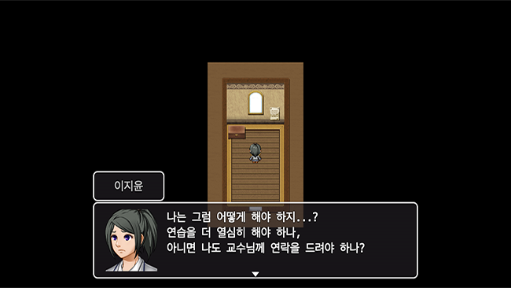

#### Details

<!-- Image Start -->
<section class="uk-section uk-padding-remove">
    

        

            <h3>"한국에서 순수예술을 한다는 것"</h3>
            
바이올리니스트를 꿈꾸는 평범한 중학생, 한국 최고의 예술고등학교 학생이 되다! 음대 입시 성공을 위해 학우들과 경쟁하고, 어느 라인에 줄을 설지 결정해야 한다!

        

          
        
 div; cls:uk-animation-slide-bottom-medium; delay: 400;">
            

                

                    

                        

                            
                        

                        

                            
                        

                        

                            
                        

                        

                            
                        

                    

                

            

            

                

                    <h2 class="uk-text-uppercase">
                        제일예고 학생들과 경쟁하자!
                    </h2>
                    

                        남몰래 갈고닦은 연주실력을 뽐내보세요! 복도나 교실에 있는 친구들과 연주 배틀(혹은 말싸움...)을 벌여 레슨비도 벌고, 거만한 친구들의 코를 납작하게 눌러줍시다!
                    

                

            

        

         
        
 div; cls:uk-animation-slide-bottom-medium; delay: 400;">
            

                

                    <h2 class="uk-text-uppercase">
                        선생님과 교수님께 레슨받자!
                    </h2>
                    

                        어느정도 실력이 쌓였다면, 음악과 레슨실로 가서 강사 선생님들께 레슨을 받아보세요! 고액의 레슨비를 내고 성공적으로 레슨을 마친다면 한번에 높은 경험치를 얻을 수 있어요!
                    

                

            

            

                

                    

                        

                            
                        

                        

                            
                        

                        

                            
                        

                        

                            
                        

                    

                

            

        

         
        
 div; cls:uk-animation-slide-bottom-medium; delay: 400;">
            

                

                    

                        

                            
                        

                        

                            
                        

                        

                            
                        

                        

                            
                        

                    

                

            

            

                

                    <h2 class="uk-text-uppercase">
                        다양한 이벤트들
                    </h2>
                    

                        대한민국 최고의 예술고등학교, 제일예고의 3학년 학생들의 생활을 엿볼 수 있어요! 친구들과의 대화, 특정 레벨에 도달하면 발생하는 이벤트로 고3들의 심리적 압박을 느껴보세요!
                    

                

            

        

         
        
 div; cls:uk-animation-slide-bottom-medium; delay: 400;">
            

                

                    <h2 class="uk-text-uppercase">
                        그리고 다양한 엔딩들
                    </h2>
                    

                        마지막으로 음대 입시 실기시험을 경험해보세요! 그동안 착실히 연주배틀과 레슨으로 실력을 쌓아두었다면, 문제없이 입시에 성공할 수 있을거예요.
                    

                

            

            

                

                    

                        

                            
                        

                        

                            
                        

                        

                            
                        

                        

                            
                        

                    

                

            

        

    

</section>
<!-- Image End -->